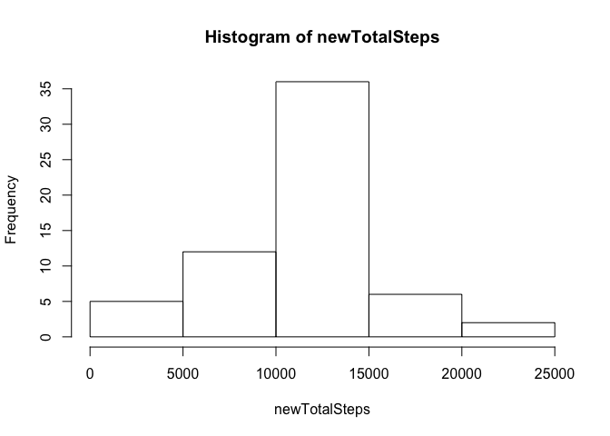

# Reproducible Research: Peer Assessment 1

## Loading and preprocessing the data

```r
activity <- read.csv("activity.csv")
```
## What is mean total number of steps taken per day?

```r
totalStepsByDate <- aggregate(. ~ date, activity, sum)[1:2]
totalSteps <- totalStepsByDate[, 2]
hist(totalSteps)
```

<!-- -->


The mean and the median value of the steps, 1.0766189\times 10^{4} and 10765

## What is the average daily activity pattern?

```r
cleanSteps <- activity[!is.na(activity$steps),]
cleanSteps <- cleanSteps[, c("interval", "steps")]
stepMean <- aggregate(cleanSteps, by=list(cleanSteps$interval), FUN=mean, na.rm=TRUE)
with(stepMean, plot(x=interval, y=steps, type="l"))
```

<!-- -->

```r
m <- apply(stepMean, 2, max)[["interval"]]
```
The interval in which max steps are taken : 2355.

## Imputing missing values
15264 missing values do exist.


```r
activityCopy <- cbind(activity)
findMeanFor <- function(interval) {
  stepMean[stepMean$interval == interval, "steps"]
}

for (i in 1:nrow(activityCopy)) {  
  if (is.na(activityCopy[i, ]$steps)) {
    meanVal <- findMeanFor(activityCopy[i, ]$interval)
    activityCopy[i, ]$steps <- meanVal 
  }
}

newTotalStepsByDate <- aggregate(. ~ date, activityCopy, sum)[1:2]
newTotalSteps <- newTotalStepsByDate[, 2]
hist(newTotalSteps)
```

<!-- -->


## Are there differences in activity patterns between weekdays and weekends?


```r
activity3 <- cbind(activity[!is.na(activity$steps), ])
activity3[, "weekday"] <- NA
for (i in 1:nrow(activity3)) { 
  ifelse(weekdays(as.Date(activity3[i, ]$date)) %in% c("Saturday","Sunday"), activity3[i, "weekday"] <- "weekend", activity3[i, "weekday"] <- "weekday")
}

stepMean <- aggregate(activity3, by=list(activity3$interval, activity3$weekday), FUN=mean, na.rm=TRUE)[, c(2,3,5)]

library(lattice)
with(stepMean, xyplot(steps ~ interval | Group.2, type="l"))
```

<!-- -->
